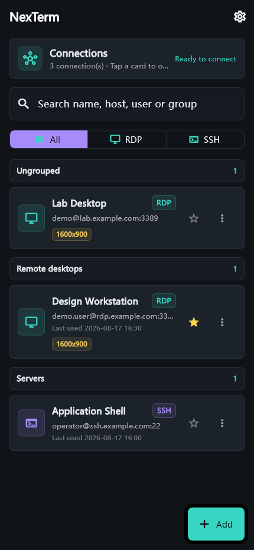
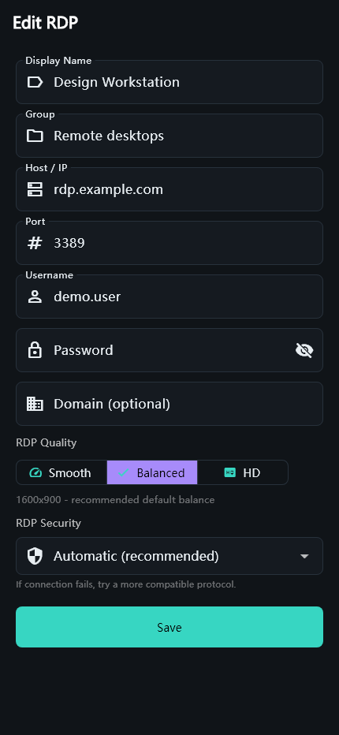
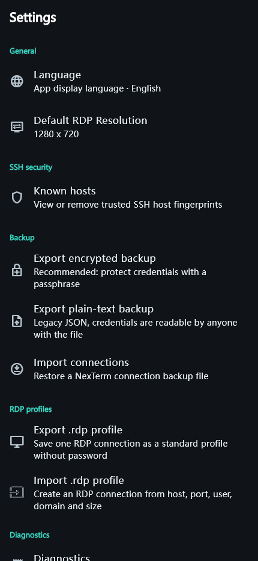

# NexTerm

NexTerm is a Flutter remote connection client for Android, iOS, and Windows.
The current source version is `1.0.72+73`.

## Features

- Android RDP through FreeRDP 3.x, Kotlin MethodChannel, C/JNI, and Flutter Texture/Surface rendering.
- Three RDP pointer modes, native IME text input, control keys, clipboard integration, health checks, and reconnect UI.
- SSH shell sessions with password or private-key authentication, passphrases, TOFU host-key verification, and xterm rendering.
- SFTP file management, local port forwarding, and one-hop SSH jump hosts.
- Connection search, groups, favorites, encrypted backups, and `.rdp` profile import/export.
- Flutter Windows desktop shell with a FreeRDP FFI path.
- A separate WinForms/MSTSCAX host experiment under `windows_native/`.
- GitHub Releases OTA checks with fail-open handling for release-service outages.

## Screenshots

<table>
  <tr>
    <td></td>
    <td></td>
    <td></td>
  </tr>
  <tr>
    <td align="center"><strong>Connection library</strong></td>
    <td align="center"><strong>RDP profile</strong></td>
    <td align="center"><strong>Settings and security</strong></td>
  </tr>
</table>

## Source Map

```text
lib/
  main.dart                         Application bootstrap
  models/                           Connection models
  providers/                        Application state
  screens/home/                     Connection list and editor
  screens/rdp/                      Android and Windows RDP sessions
  screens/ssh/                      SSH terminal
  screens/sftp/                     SFTP file manager
  screens/desktop/                  Windows Flutter shell
  screens/settings/                 Settings and diagnostics
  utils/                             RDP, SSH, backup, OTA, and storage services

android/app/src/main/
  kotlin/com/nexterm/nexterm/       Android platform bridge
  cpp/nexterm_jni.c                 FreeRDP JNI bridge
  jniLibs/                          FreeRDP runtime libraries

windows/native/                     Flutter Windows FreeRDP bridge
windows_native/                     Standalone WinForms/MSTSCAX host
```

## Development

Install Flutter with a compatible Android toolchain, then run from the repository root:

```powershell
flutter pub get
flutter analyze
flutter test
flutter build apk --release
```

Release signing is read from `android/key.properties` when present. Keep that file and all keystores local; they are excluded by `.gitignore`.

For Flutter Windows:

```powershell
flutter build windows
```

The Windows runner loads the native libraries under `windows/native/dlls/`.

## Security

- Connection metadata is stored separately from credentials.
- Passwords, private keys, and passphrases use secure platform storage.
- Encrypted connection backups use AES-256-GCM with PBKDF2-HMAC-SHA256.
- Plain-text backups are supported only for compatibility and contain credentials; store them securely.
- Do not commit tokens, keystores, `android/key.properties`, private keys, exported backups, or local release tooling.

## OTA

The client checks the repository's latest GitHub Release for `app-release.apk`. Network or release-service check failures do not lock the app. When a newer version has been detected and startup updates are required, an APK download failure cannot be skipped.
